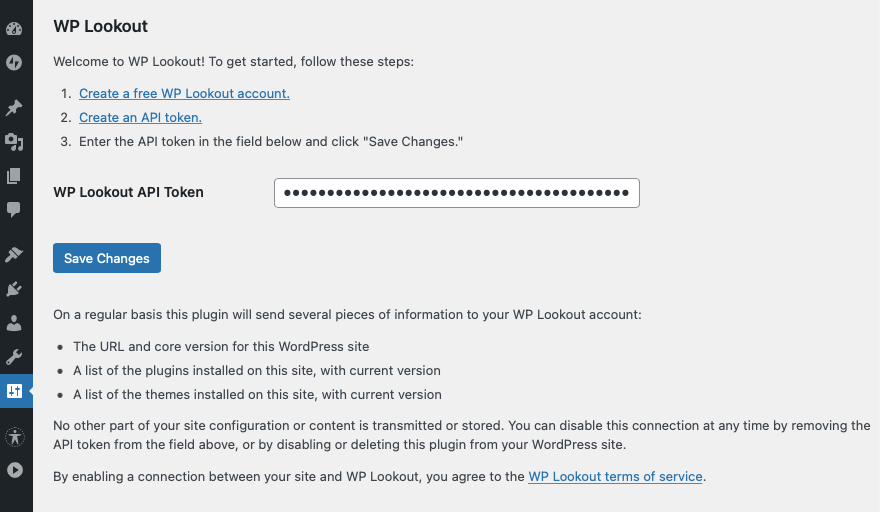

# WP Lookout

> A companion plugin to WPLookout.com, which tracks changes and updates to the plugins and themes you depend on.

    

## Description

[WP Lookout](https://wplookout.com/) is a free tool that tracks important changes and updates to the plugins and themes you depend on. Instead of visiting wp-admin on all of your sites to see what's new and what needs updating, WP Lookout brings the information to you in a timely, helpful, centralized way.

New version released? Changelog update that mentions a security fix? New plugin author ownership? WP Lookout will notify you of these events and others by email, Slack, webhook, RSS feed and more.

After installing and activating this plugin, simply input the API token generated in your [free WP Lookout account](https://app.wplookout.com/register) to quickly start tracking the plugins and themes in use on your site. (There is also a WP CLI command available to automate setting the API key.) There are no limits to the number of sites you can connect!

Free features include:

* Theme and plugin monitoring for unlimited websites
* 24/7 tracking of critical changes and new releases
* Email notifications, with optional upgrades for Slack and custom Webhook notifications
* At-a-glance dashboard overview of all your connected sites
* 2FA account security
* Friendly email support

If you're not ready to go all in on auto-updates, or if you're getting too many update notifications from all of your sites, WP Lookout is a great alternative. Knowing the details of what's changing and what it means for the sites you've built will help you avoid any problems and better troubleshoot theme or plugin conflicts that do arise.

For more information about WP Lookout, [check out our website at WPLookout.com](https://wplookout.com).

### WP Lookout tracking activity example

### WP Lookout Settings

### Example plugin update email notification

### Example sites dashboard

## Requirements

* [WordPress](http://wordpress.org) 5.2.2+
* [WP Lookout account](https://wplookout.com/)

## Installation

WP Lookout is most easily installed via the Plugins tab in your admin dashboard.

## Support Level

**Active:** I actively maintain this project, and expect to continue work for the foreseeable future including keeping tested up to the most recent version of WordPress. Bug reports, feature requests, questions, and pull requests are welcome.

## Contributing

Pull requests and issues on [GitHub](https://github.com/WPLookout/wp-lookout) are welcome.
