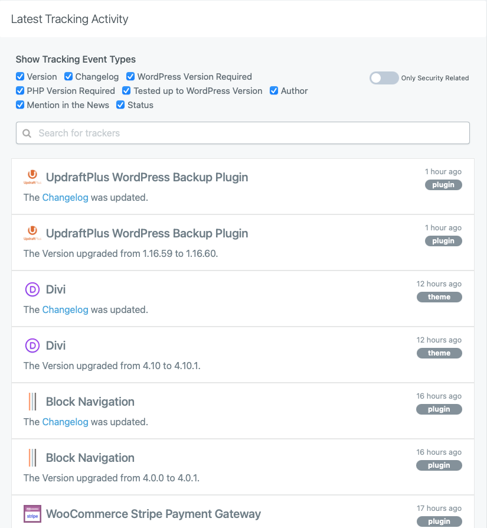

# WP Lookout

> A companion plugin to WPLookout.com, which tracks changes and updates to the plugins and themes you depend on.

    

## Description

This plugin is an optional way to use WP Lookout, a service that tracks changes and updates to the plugins and themes you depend on. It sends information about the plugins and themes in use on your site to your WP Lookout account, where you can receive notifications about changes and updates.

It's free to [sign up for WP Lookout](https://app.wplookout.com/register). Once your account is active, you can generate an API key that gets added to the "WP Lookout" page under your Settings menu. That's it! The plugin will take care of everything from there on out.

By enabling a connection between your site and WP Lookout, you agree to the [WP Lookout terms of service](https://wplookout.com/terms-and-conditions/).

### WP Lookout tracking activity example

### WP Lookout Settings

### Example plugin update notification

## Requirements

* [WordPress](http://wordpress.org) 5.2.2+
* [WP Lookout account](https://wplookout.com/)

## Installation

WP Lookout is most easily installed via the Plugins tab in your admin dashboard.

## Support Level

**Active:** I actively maintain this project, and expect to continue work for the foreseeable future including keeping tested up to the most recent version of WordPress. Bug reports, feature requests, questions, and pull requests are welcome.

## Contributing

Pull requests and issues on [GitHub](https://github.com/ChrisHardie/wp-lookout) are welcome.
